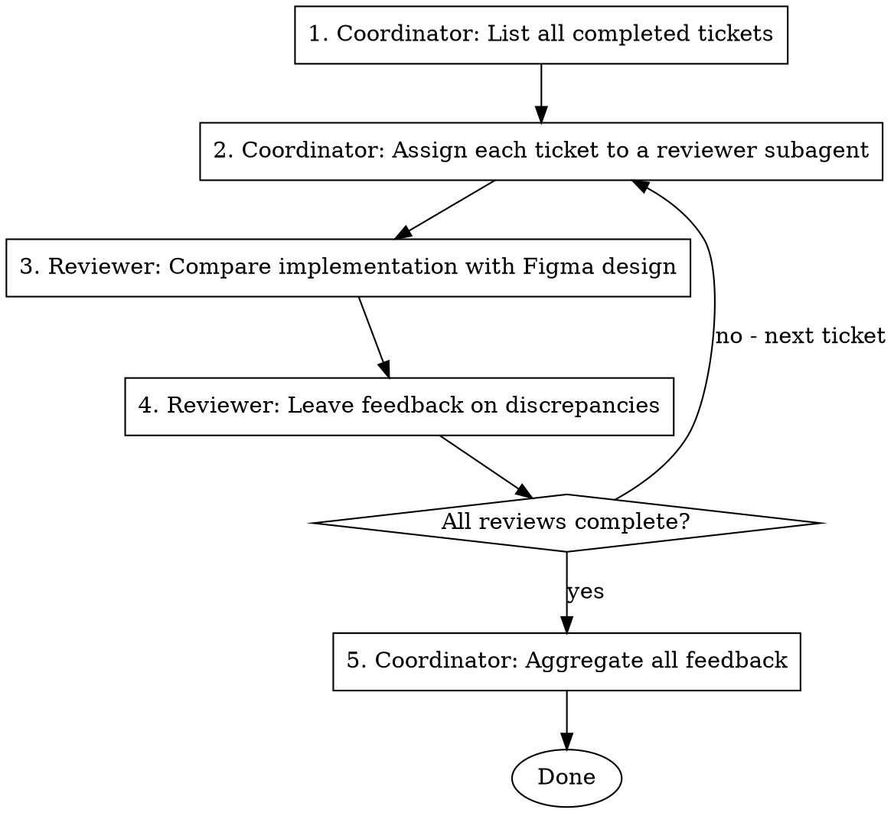

# Design Verification Loop

Verify that all completed tickets match their Figma designs by coordinating multiple reviewer subagents.

## Process



## Roles

### Coordinator Subagent
- Lists all completed tickets that need design verification
- Dispatches reviewer subagents for each ticket
- Aggregates feedback from all reviewers
- Summarizes total discrepancies found

### Reviewer Subagent
- Receives a specific ticket/component to verify
- Fetches the Figma design using MCP tools
- Compares implementation with design
- Reports discrepancies (spacing, colors, typography, layout, etc.)

## Coordinator Prompt Template

```
You are a design verification coordinator. Your job is to:

1. List all completed tickets from the current branch that need design verification
2. For each ticket, dispatch a reviewer subagent with:
   - Ticket number and description
   - Figma file URL and node ID
   - Component file path(s)
3. Collect feedback from all reviewers
4. Summarize findings in a structured report

Tickets to verify:
{list of tickets with Figma URLs}

Use the Task tool to dispatch reviewer subagents in parallel where possible.
```

## Reviewer Prompt Template

```
You are a design reviewer. Compare the implementation with the Figma design.

Ticket: {ticket_number}
Description: {ticket_description}
Figma URL: {figma_url}
Component files: {file_paths}

Steps:
1. Use mcp__figma-remote-mcp__get_screenshot to capture the Figma design
2. Read the component implementation files
3. Compare:
   - Layout and spacing
   - Colors and typography
   - Icons and images
   - Responsive behavior (if applicable)
   - Interactive states (hover, active, disabled)

Report format:
- MATCH: Design and implementation are identical
- DISCREPANCY: List specific differences with file:line references

Be precise. Only report actual visual differences, not code style preferences.
```

## Example Workflow

```
You: Running design verification for all completed tickets

[Coordinator starts]
Coordinator: Found 3 tickets needing design verification:
- AP-5357: 승인/반려 모달
- AP-5351: SubCategoryContainer
- AP-5352: VendorItem

[Dispatch reviewer for AP-5357]
Reviewer AP-5357:
- Fetched Figma screenshot
- Compared with ApproveModal.tsx, RejectModal.tsx
- Result: MATCH

[Dispatch reviewer for AP-5351]
Reviewer AP-5351:
- Fetched Figma screenshot
- Compared with SubCategoryContainer.tsx
- Result: DISCREPANCY
  - Line 45: padding should be 16px, currently 12px
  - Line 52: font-weight should be 600, currently 500

[Dispatch reviewer for AP-5352]
Reviewer AP-5352:
- Fetched Figma screenshot
- Compared with VendorItem.tsx
- Result: MATCH

[Coordinator aggregates]
Coordinator: Design Verification Complete
- Total tickets: 3
- Matches: 2
- Discrepancies: 1

Discrepancies to fix:
1. AP-5351 SubCategoryContainer:
   - padding: 12px → 16px
   - font-weight: 500 → 600

Done!
```

## Tools Used

- `mcp__figma-remote-mcp__get_screenshot` - Capture Figma design
- `mcp__figma-remote-mcp__get_design_context` - Get design details (colors, spacing, etc.)
- `Task` tool - Dispatch reviewer subagents
- `Read` tool - Read implementation files

## Tips

- Run reviewers in parallel for efficiency
- Use Figma node IDs from ticket specs when available
- Focus on visual differences, not code patterns
- Include specific file:line references for easy fixing
