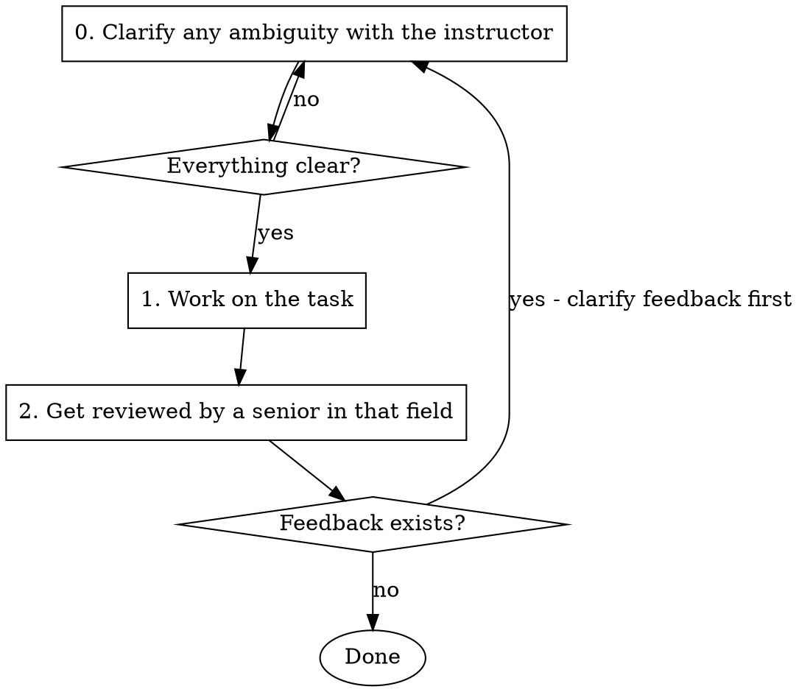

# Work and Review Loop

Execute tasks with an iterative review cycle: clarify, work, get reviewed by a domain senior, fix feedback, repeat until approved.

## Process



## Steps

0. **Clarify**: If anything is unclear, ask the instructor questions until everything is crystal clear
1. **Work**: Complete the assigned task(s)
2. **Review**: Dispatch a senior-level reviewer subagent in that domain to review your work
3. **Iterate or Finish**:
   - If feedback exists: Return to step 0 to clarify the feedback, then fix
   - If no feedback: Task complete

## Important Rules

- **Never proceed with ambiguity**: If requirements, scope, approach, or feedback are unclear, stop and ask the instructor
- **Keep asking until clear**: Don't assume or guess. Ask follow-up questions until you fully understand
- **Review is mandatory**: Always get senior review before marking complete
- **Clarify feedback too**: When you receive review feedback, make sure you understand it before fixing

## Reviewer Subagent

When dispatching the reviewer, use the Task tool with a prompt like:

```
You are a senior {domain} engineer. Review the following work:

{work description and context}

Files changed: {list of files}

Provide feedback on:
- Correctness
- Best practices
- Code quality
- Edge cases

If everything looks good, respond with "APPROVED". Otherwise, list specific issues to fix.
```

## Example

```
You: I need to implement the authentication feature

[Step 0: Clarify]
You: "Should this support OAuth, or just email/password?"
Instructor: "Email/password only for now"

You: "Should we include 'forgot password' flow?"
Instructor: "Yes, with email verification"

[Step 1: Work - now clear, proceed]
[Implement login flow with forgot password]

[Step 2: Review]
[Dispatch senior backend reviewer]
Reviewer: Issues found:
- Missing rate limiting
- Password reset token expiration unclear

[Step 0: Clarify feedback]
You: "For rate limiting, how many attempts before lockout?"
Instructor: "5 attempts, then 15 minute lockout"

You: "Password reset token - 15 minutes expiration?"
Instructor: "Yes, 15 minutes"

[Step 1: Work - fix with clarity]
[Apply fixes with clear requirements]

[Step 2: Review again]
[Dispatch senior backend reviewer again]
Reviewer: APPROVED

Done!
```
